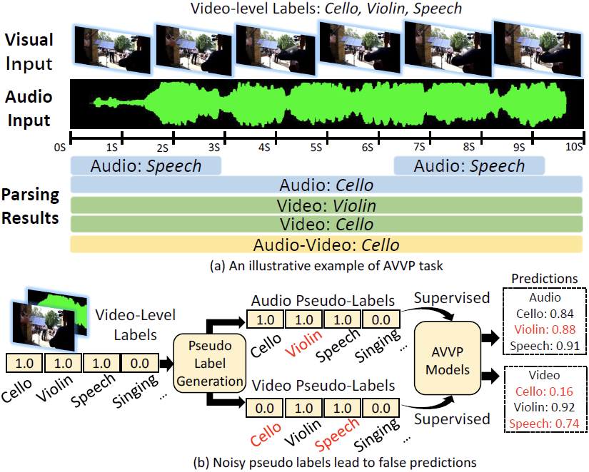
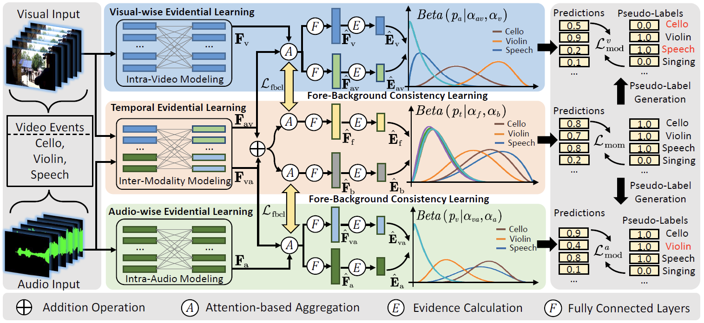
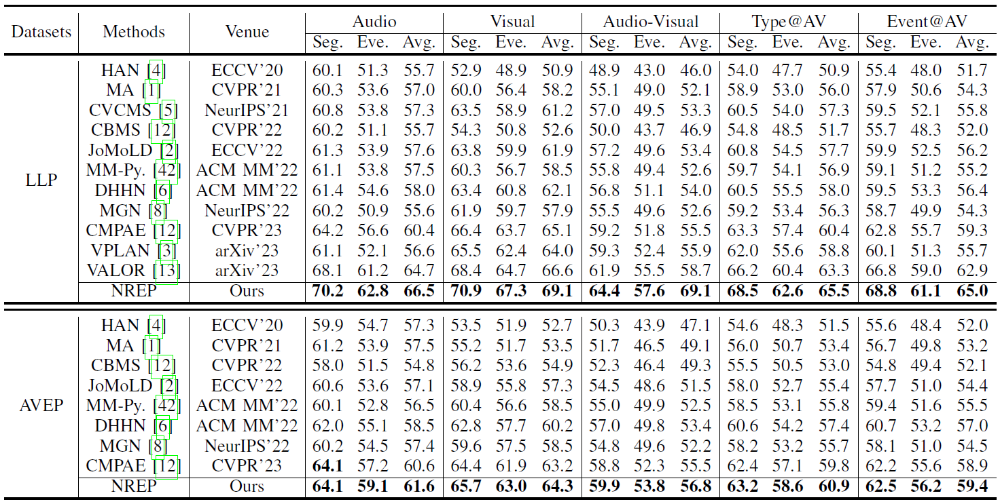

# Introduction

This is our implementation codes of *"Resisting Noise in Pseudo-Labels: Audible Video
Event Parsing with Evidential Learning"* .

## Noise-Resistant Event Parsing

The Audio-Visual Video Parsing task generally follows weakly-supervised learning settings, since only videolevel labels are provided. Most existing works usually generate modality-wise pseudo-labels first then learn to parse audio or visual events from the audible videos. However, this paradigm inevitably results in two defects: 1) The generated pseudolabels for each modality are not fully reliable, which may confuse models if they are adopted as supervision signals for discriminating modalities. 2) The absence of temporal supervision increases the ambiguities in localizing foregrounds in videos, furtherly causing models prone to being disturbed by noisy labels. To tackle these problems, we propose a novel AVVP framework termed Noise-Resistant Event Parsing (NREP), which introduces evidential deep learning to overcome the limitations of noisy pseudo supervision. Through perceiving meaningful video content and learning evidence for modality dependencies, our method suppresses the disturbance of noise in generated pseudo-labels thus achieves remarkable performance with different pseudo-label generation strategies. We evaluate our NREP method on two AVVP benchmark datasets and demonstrate it consistently establishes new state-of-the-art.



## Insight of Our Work

1. We propose a novel framework termed Noise-Resistant Event Parsing (NREP) for AVVP, which utilizes evidential
deep learning to overcome the noise in generated pseudo labels. Instead of using conventional additive probability, it tackles this task by calculating probabilities with Subjective Logic for each event category.
2. We design a dual evidential learning architecture, which contains a Modality-wise Evidential Learning module
(MEL) and a Temporal-wise Evidential Learning module (TEL), to adapt EDL in modal and temporal dimensions.
Such a design defends the model from noise disturbance in discriminating modality dependencies and temporal
fore-background for each video event synchronously.
3. To collaborate the modality-wise and temporal-wise evidential learning branches, we furtherly propose an attention
consistency learning mechanism, which keeps the model perceiving from meaningful temporal foregrounds in two branches consistently.
4. We conduct extensive experiments and the experimental results demonstrate that our method remarkably outperforms other state-of-the-art methods.



# Data Preparation  

Please follow [VALOR](https://github.com/Franklin905/VALOR) and [CMPAE](https://github.com/MengyuanChen21/CVPR2023-CMPAE) to download the off-the-shelf visual and audio features.

# Training and Testing

Please use the following command to train our model:  

```bash
sh run.sh
```

If you want to evaluate a pre-trained model, please use the following command:

# Comparisons with recent state-of-the-art methods


